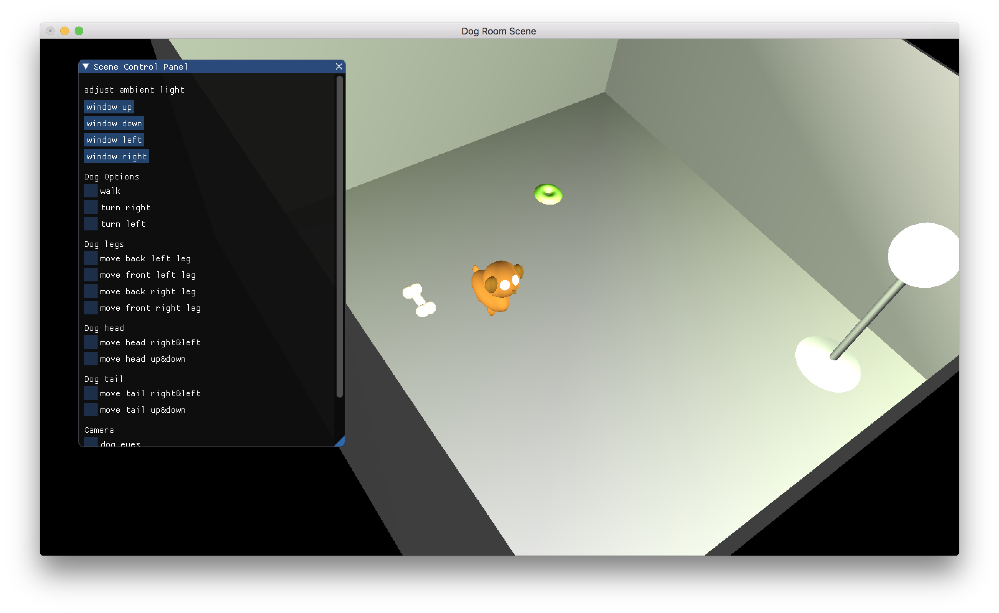
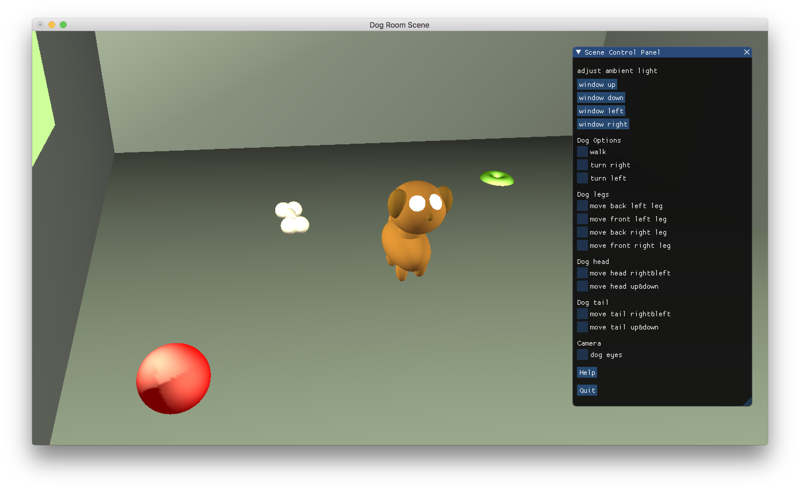

# Puppy Room Graphics OpenGL Project
Written in C++ with OpenGL 1.XX, GLUT, IMGUI, STB_IMAGE. Built with Cmake. 

## Features
1. Puppy and objects created from spheres.
2. Puppy walks and turns.
3. Puppy/object collision detection.
4. Puppy head/tal/leg animations. 
5. Rich control menu.
6. Various material lighting properties.
7. Point direction-less light source (lamp) and point spotlight (window).
8. Ability to change light intensity and directions.
9. Basis for texture implementation (see `./stb_image` and `./floor.cpp`) - NOT IMPLEMENTED.

